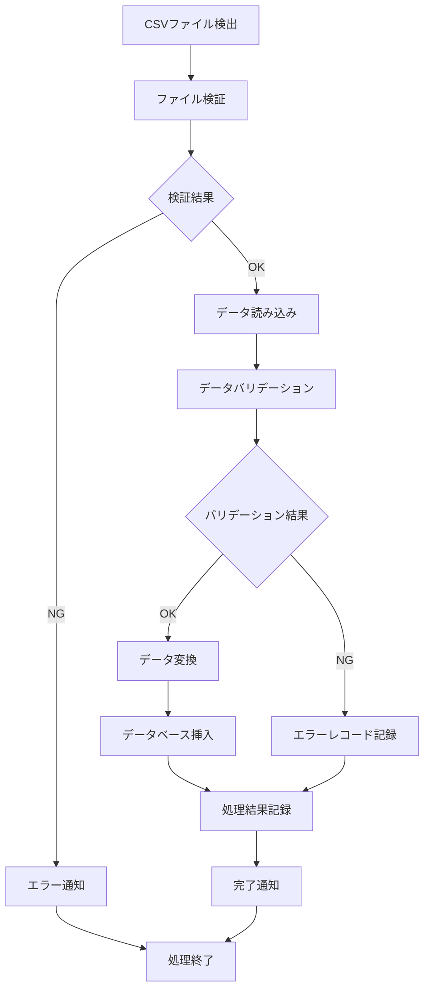

# バッチ設計書

## 概要
CSVファイルからSQL Serverへのデータ変換バッチ処理の詳細設計を定義します。

## バッチ処理アーキテクチャ

### 処理フロー


## スケジューリング設計

### APScheduler設定
```python
from apscheduler.schedulers.background import BackgroundScheduler
from apscheduler.jobstores.sqlalchemy import SQLAlchemyJobStore
from apscheduler.executors.pool import ThreadPoolExecutor
import pytz

jobstores = {
    'default': SQLAlchemyJobStore(url='sqlite:///jobs.sqlite')
}

executors = {
    'default': ThreadPoolExecutor(20),
}

job_defaults = {
    'coalesce': False,
    'max_instances': 3
}

scheduler = BackgroundScheduler(
    jobstores=jobstores,
    executors=executors,
    job_defaults=job_defaults,
    timezone=pytz.timezone('Asia/Tokyo')
)

@scheduler.scheduled_job('cron', hour=2, minute=0, id='daily_batch')
def daily_batch_job():
    """日次バッチ処理（深夜2時実行）"""
    batch_processor = BatchProcessor()
    batch_processor.execute_daily_batch()

scheduler.start()
```

### バッチスケジュール定義
| バッチ名 | 実行頻度 | 実行時間 | 説明 |
|----------|----------|----------|------|
| 日次データ処理 | 日次 | 深夜2:00 | CSVファイルの自動処理 |
| ログクリーンアップ | 日次 | 深夜3:00 | 古いログファイルの削除 |
| データアーカイブ | 月次 | 第1日曜日 3:00 | 古いデータのアーカイブ |
| ヘルスチェック | 5分毎 | - | システム状態監視 |

## バッチ処理クラス設計

### BatchProcessor クラス
```python
import pandas as pd
from sqlalchemy.orm import sessionmaker
from marshmallow import ValidationError
import structlog
from typing import List, Dict, Any
from dataclasses import dataclass
from enum import Enum

class BatchStatus(Enum):
    PENDING = "PENDING"
    RUNNING = "RUNNING"
    SUCCESS = "SUCCESS"
    ERROR = "ERROR"
    STOPPED = "STOPPED"

@dataclass
class BatchResult:
    batch_id: int
    status: BatchStatus
    total_records: int
    success_records: int
    error_records: int
    processing_time: float
    error_messages: List[str]

class BatchProcessor:
    def __init__(self, db_session, azure_client, logger):
        self.db_session = db_session
        self.azure_client = azure_client
        self.logger = logger
        self.validator = WorkRecordValidator()
    
    def execute_batch(self, file_name: str, options: Dict[str, Any] = None) -> BatchResult:
        """バッチ処理のメイン実行メソッド"""
        batch_id = self._start_batch(file_name)
        
        try:
            self.logger.info("バッチ処理開始", batch_id=batch_id, file_name=file_name)
            
            self._validate_file(file_name)
            
            df = self._read_csv_file(file_name)
            
            result = self._process_data(batch_id, df, options or {})
            
            self._complete_batch(batch_id, result)
            
            self.logger.info("バッチ処理完了", batch_id=batch_id, result=result)
            return result
            
        except Exception as e:
            self.logger.error("バッチ処理エラー", batch_id=batch_id, error=str(e))
            self._fail_batch(batch_id, str(e))
            raise
    
    def _validate_file(self, file_name: str):
        """CSVファイルの基本検証"""
        file_path = self.azure_client.download_file(file_name)
        
        file_size = os.path.getsize(file_path)
        if file_size > 100 * 1024 * 1024:
            raise ValueError(f"ファイルサイズが上限を超過: {file_size}")
        
        try:
            pd.read_csv(file_path, nrows=1, encoding='utf-8')
        except Exception as e:
            raise ValueError(f"CSV形式エラー: {str(e)}")
    
    def _read_csv_file(self, file_name: str) -> pd.DataFrame:
        """CSVファイルの読み込み"""
        file_path = self.azure_client.download_file(file_name)
        
        df = pd.read_csv(
            file_path,
            encoding='utf-8',
            dtype={
                'employee_id': str,
                'project_id': str,
                'work_hours': float,
                'hourly_rate': float,
                'total_cost': float,
                'order_amount': float
            },
            parse_dates=['work_date']
        )
        
        return df
    
    def _process_data(self, batch_id: int, df: pd.DataFrame, options: Dict) -> BatchResult:
        """データ処理のメインロジック"""
        total_records = len(df)
        success_records = 0
        error_records = 0
        error_messages = []
        
        start_time = time.time()
        
        for index, row in df.iterrows():
            try:
                validated_data = self.validator.validate(row.to_dict())
                
                if options.get('skip_duplicates', True):
                    if self._is_duplicate(validated_data):
                        continue
                
                self._insert_work_record(validated_data)
                success_records += 1
                
                if (index + 1) % 1000 == 0:
                    self.logger.info(
                        "処理進捗",
                        batch_id=batch_id,
                        processed=index + 1,
                        total=total_records,
                        progress=round((index + 1) / total_records * 100, 2)
                    )
                
            except ValidationError as e:
                error_records += 1
                error_msg = f"行{index + 1}: バリデーションエラー - {str(e)}"
                error_messages.append(error_msg)
                self.logger.warning("バリデーションエラー", 
                                  batch_id=batch_id, 
                                  row=index + 1, 
                                  error=str(e))
                
            except Exception as e:
                error_records += 1
                error_msg = f"行{index + 1}: 処理エラー - {str(e)}"
                error_messages.append(error_msg)
                self.logger.error("処理エラー", 
                                batch_id=batch_id, 
                                row=index + 1, 
                                error=str(e))
        
        processing_time = time.time() - start_time
        
        if error_records == 0:
            status = BatchStatus.SUCCESS
        elif success_records > 0:
            status = BatchStatus.SUCCESS
        else:
            status = BatchStatus.ERROR
        
        return BatchResult(
            batch_id=batch_id,
            status=status,
            total_records=total_records,
            success_records=success_records,
            error_records=error_records,
            processing_time=processing_time,
            error_messages=error_messages[:100]
        )
```

## エラーハンドリング設計

### エラー分類
| エラー種別 | 説明 | 対応方法 |
|------------|------|----------|
| ファイルエラー | ファイル形式不正、サイズ超過 | ファイル検証強化、通知 |
| バリデーションエラー | データ形式不正、必須項目不足 | エラーレコード記録、継続処理 |
| データベースエラー | 接続失敗、制約違反 | リトライ、ロールバック |
| システムエラー | メモリ不足、予期しない例外 | 処理停止、アラート |

### リトライ機能
```python
import time
from functools import wraps

def retry(max_attempts=3, delay=1, backoff=2):
    def decorator(func):
        @wraps(func)
        def wrapper(*args, **kwargs):
            attempts = 0
            current_delay = delay
            
            while attempts < max_attempts:
                try:
                    return func(*args, **kwargs)
                except Exception as e:
                    attempts += 1
                    if attempts >= max_attempts:
                        raise e
                    
                    self.logger.warning(
                        "処理リトライ",
                        function=func.__name__,
                        attempt=attempts,
                        max_attempts=max_attempts,
                        error=str(e)
                    )
                    
                    time.sleep(current_delay)
                    current_delay *= backoff
            
            return None
        return wrapper
    return decorator

class DatabaseService:
    @retry(max_attempts=3, delay=1, backoff=2)
    def insert_work_record(self, data):
        """データベース挿入（リトライ機能付き）"""
        try:
            work_record = WorkRecord(**data)
            self.db_session.add(work_record)
            self.db_session.commit()
        except Exception as e:
            self.db_session.rollback()
            raise e
```

## 並行処理設計

### マルチプロセッシング
```python
import multiprocessing as mp
from concurrent.futures import ProcessPoolExecutor, as_completed

class ParallelBatchProcessor:
    def __init__(self, max_workers=4):
        self.max_workers = max_workers
    
    def process_large_file(self, file_name: str, chunk_size: int = 1000):
        """大容量ファイルの並行処理"""
        df = pd.read_csv(file_name)
        chunks = [df[i:i+chunk_size] for i in range(0, len(df), chunk_size)]
        
        with ProcessPoolExecutor(max_workers=self.max_workers) as executor:
            futures = {
                executor.submit(self._process_chunk, chunk, i): i 
                for i, chunk in enumerate(chunks)
            }
            
            results = []
            for future in as_completed(futures):
                chunk_id = futures[future]
                try:
                    result = future.result()
                    results.append(result)
                    self.logger.info("チャンク処理完了", chunk_id=chunk_id)
                except Exception as e:
                    self.logger.error("チャンク処理エラー", chunk_id=chunk_id, error=str(e))
        
        return self._merge_results(results)
    
    def _process_chunk(self, chunk_df, chunk_id):
        """チャンク単位の処理"""
        processor = BatchProcessor()
        return processor.process_dataframe(chunk_df, chunk_id)
```

## 監視・通知設計

### 処理状況監視
```python
class BatchMonitor:
    def __init__(self, redis_client):
        self.redis = redis_client
    
    def update_progress(self, batch_id: int, progress_data: dict):
        """処理進捗の更新"""
        key = f"batch_progress:{batch_id}"
        self.redis.hset(key, mapping=progress_data)
        self.redis.expire(key, 86400)
    
    def get_progress(self, batch_id: int) -> dict:
        """処理進捗の取得"""
        key = f"batch_progress:{batch_id}"
        return self.redis.hgetall(key)
    
    def publish_status_update(self, batch_id: int, status: str):
        """ステータス更新の配信"""
        message = {
            'batch_id': batch_id,
            'status': status,
            'timestamp': datetime.utcnow().isoformat()
        }
        self.redis.publish('batch_status', json.dumps(message))
```

### 通知サービス
```python
import smtplib
from email.mime.text import MIMEText
from email.mime.multipart import MIMEMultipart

class NotificationService:
    def __init__(self, smtp_config):
        self.smtp_config = smtp_config
    
    def send_batch_completion_email(self, batch_result: BatchResult, recipients: List[str]):
        """バッチ処理完了通知メール"""
        subject = f"バッチ処理完了通知 - {batch_result.status.value}"
        
        body = f"""
        バッチ処理が完了しました。
        
        バッチID: {batch_result.batch_id}
        処理状況: {batch_result.status.value}
        総レコード数: {batch_result.total_records:,}
        成功レコード数: {batch_result.success_records:,}
        エラーレコード数: {batch_result.error_records:,}
        処理時間: {batch_result.processing_time:.2f}秒
        
        詳細はシステムダッシュボードをご確認ください。
        """
        
        self._send_email(recipients, subject, body)
    
    def send_error_alert(self, error_message: str, batch_id: int = None):
        """エラーアラート通知"""
        subject = "バッチ処理エラーアラート"
        
        body = f"""
        バッチ処理でエラーが発生しました。
        
        バッチID: {batch_id or 'N/A'}
        エラー内容: {error_message}
        発生時刻: {datetime.utcnow().isoformat()}
        
        至急確認をお願いします。
        """
        
        admin_emails = self._get_admin_emails()
        self._send_email(admin_emails, subject, body)
```

## パフォーマンス最適化

### データベース最適化
```python
class OptimizedDatabaseService:
    def __init__(self, db_session):
        self.db_session = db_session
        self.batch_size = 1000
    
    def bulk_insert_work_records(self, records: List[dict]):
        """バルクインサート最適化"""
        try:
            for i in range(0, len(records), self.batch_size):
                batch = records[i:i + self.batch_size]
                
                self.db_session.bulk_insert_mappings(WorkRecord, batch)
                
                if i % (self.batch_size * 10) == 0:
                    self.db_session.commit()
            
            self.db_session.commit()
            
        except Exception as e:
            self.db_session.rollback()
            raise e
    
    def optimize_for_batch_processing(self):
        """バッチ処理用の最適化設定"""
        self.db_session.autocommit = False
        
        self.db_session.execute("SET TRANSACTION ISOLATION LEVEL READ UNCOMMITTED")
```

## 設定管理

### バッチ設定
```python
from dataclasses import dataclass
from typing import Optional

@dataclass
class BatchConfig:
    max_file_size: int = 100 * 1024 * 1024
    batch_size: int = 1000
    max_workers: int = 4
    retry_attempts: int = 3
    timeout_seconds: int = 3600
    notification_emails: List[str] = None
    skip_duplicates: bool = True
    validate_only: bool = False
    
    @classmethod
    def from_env(cls):
        """環境変数から設定を読み込み"""
        return cls(
            max_file_size=int(os.getenv('BATCH_MAX_FILE_SIZE', 100 * 1024 * 1024)),
            batch_size=int(os.getenv('BATCH_SIZE', 1000)),
            max_workers=int(os.getenv('BATCH_MAX_WORKERS', 4)),
            retry_attempts=int(os.getenv('BATCH_RETRY_ATTEMPTS', 3)),
            timeout_seconds=int(os.getenv('BATCH_TIMEOUT_SECONDS', 3600)),
            notification_emails=os.getenv('BATCH_NOTIFICATION_EMAILS', '').split(','),
            skip_duplicates=os.getenv('BATCH_SKIP_DUPLICATES', 'true').lower() == 'true',
            validate_only=os.getenv('BATCH_VALIDATE_ONLY', 'false').lower() == 'true'
        )
```
