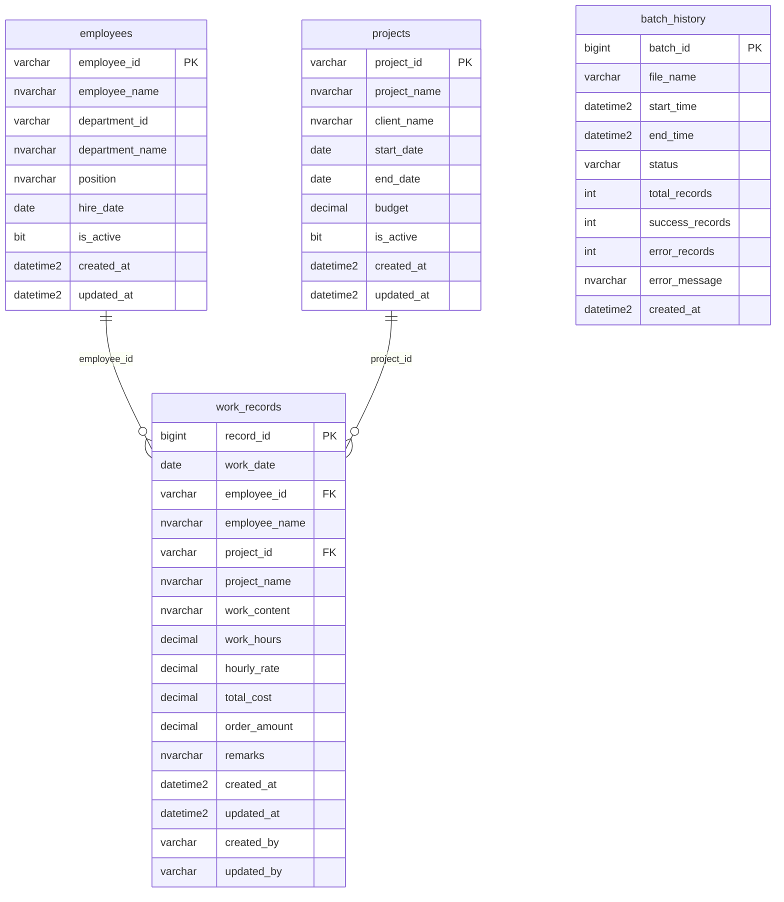

# データベース設計書

## ER図



## テーブル定義書

### 1. 作業実績テーブル (work_records)

| 項目名 | 物理名 | データ型 | 長さ | NULL | デフォルト | 制約 | 説明 |
|--------|--------|----------|------|------|------------|------|------|
| レコードID | record_id | BIGINT | - | NOT NULL | IDENTITY(1,1) | PK | 自動採番主キー |
| 作業日 | work_date | DATE | - | NOT NULL | - | - | 作業実施日 |
| 社員ID | employee_id | VARCHAR | 10 | NOT NULL | - | FK | 社員識別子 |
| 社員名 | employee_name | NVARCHAR | 50 | NOT NULL | - | - | 社員氏名 |
| プロジェクトID | project_id | VARCHAR | 20 | NOT NULL | - | FK | プロジェクト識別子 |
| プロジェクト名 | project_name | NVARCHAR | 100 | NOT NULL | - | - | プロジェクト名称 |
| 作業内容 | work_content | NVARCHAR | 200 | NOT NULL | - | - | 作業詳細 |
| 工数 | work_hours | DECIMAL | 5,2 | NOT NULL | - | CHECK >= 0 | 作業時間（時間） |
| 単価 | hourly_rate | DECIMAL | 10,0 | NOT NULL | - | CHECK >= 0 | 時間単価（円） |
| 費用 | total_cost | DECIMAL | 12,0 | NOT NULL | - | CHECK >= 0 | 総費用（円） |
| 発注金額 | order_amount | DECIMAL | 12,0 | NULL | - | CHECK >= 0 | 外部発注金額（円） |
| 備考 | remarks | NVARCHAR | 500 | NULL | - | - | 補足情報 |
| 作成日時 | created_at | DATETIME2 | 3 | NOT NULL | GETDATE() | - | レコード作成日時 |
| 更新日時 | updated_at | DATETIME2 | 3 | NOT NULL | GETDATE() | - | レコード更新日時 |
| 作成者 | created_by | VARCHAR | 50 | NOT NULL | 'SYSTEM' | - | レコード作成者 |
| 更新者 | updated_by | VARCHAR | 50 | NOT NULL | 'SYSTEM' | - | レコード更新者 |

**インデックス:**
- PRIMARY KEY: record_id
- UNIQUE KEY: (work_date, employee_id, project_id)
- INDEX: work_date, employee_id, project_id, created_at

### 2. 社員マスタテーブル (employees)

| 項目名 | 物理名 | データ型 | 長さ | NULL | デフォルト | 制約 | 説明 |
|--------|--------|----------|------|------|------------|------|------|
| 社員ID | employee_id | VARCHAR | 10 | NOT NULL | - | PK | 社員識別子 |
| 社員名 | employee_name | NVARCHAR | 50 | NOT NULL | - | - | 社員氏名 |
| 部署ID | department_id | VARCHAR | 10 | NULL | - | - | 部署識別子 |
| 部署名 | department_name | NVARCHAR | 50 | NULL | - | - | 部署名称 |
| 役職 | position | NVARCHAR | 30 | NULL | - | - | 役職名 |
| 入社日 | hire_date | DATE | - | NULL | - | - | 入社年月日 |
| 有効フラグ | is_active | BIT | - | NOT NULL | 1 | - | 有効/無効 |
| 作成日時 | created_at | DATETIME2 | 3 | NOT NULL | GETDATE() | - | レコード作成日時 |
| 更新日時 | updated_at | DATETIME2 | 3 | NOT NULL | GETDATE() | - | レコード更新日時 |

**インデックス:**
- PRIMARY KEY: employee_id
- INDEX: department_id, is_active

### 3. プロジェクトマスタテーブル (projects)

| 項目名 | 物理名 | データ型 | 長さ | NULL | デフォルト | 制約 | 説明 |
|--------|--------|----------|------|------|------------|------|------|
| プロジェクトID | project_id | VARCHAR | 20 | NOT NULL | - | PK | プロジェクト識別子 |
| プロジェクト名 | project_name | NVARCHAR | 100 | NOT NULL | - | - | プロジェクト名称 |
| 顧客名 | client_name | NVARCHAR | 100 | NULL | - | - | 顧客名称 |
| 開始日 | start_date | DATE | - | NULL | - | - | プロジェクト開始日 |
| 終了日 | end_date | DATE | - | NULL | - | - | プロジェクト終了日 |
| 予算 | budget | DECIMAL | 15,0 | NULL | - | CHECK >= 0 | プロジェクト予算（円） |
| 有効フラグ | is_active | BIT | - | NOT NULL | 1 | - | 有効/無効 |
| 作成日時 | created_at | DATETIME2 | 3 | NOT NULL | GETDATE() | - | レコード作成日時 |
| 更新日時 | updated_at | DATETIME2 | 3 | NOT NULL | GETDATE() | - | レコード更新日時 |

**インデックス:**
- PRIMARY KEY: project_id
- INDEX: start_date, end_date, is_active

### 4. バッチ処理履歴テーブル (batch_history)

| 項目名 | 物理名 | データ型 | 長さ | NULL | デフォルト | 制約 | 説明 |
|--------|--------|----------|------|------|------------|------|------|
| バッチID | batch_id | BIGINT | - | NOT NULL | IDENTITY(1,1) | PK | 自動採番主キー |
| ファイル名 | file_name | VARCHAR | 255 | NOT NULL | - | - | 処理対象ファイル名 |
| 開始時刻 | start_time | DATETIME2 | 3 | NOT NULL | - | - | バッチ処理開始時刻 |
| 終了時刻 | end_time | DATETIME2 | 3 | NULL | - | - | バッチ処理終了時刻 |
| 処理状況 | status | VARCHAR | 20 | NOT NULL | - | CHECK IN ('RUNNING', 'SUCCESS', 'ERROR') | 処理状況 |
| 総レコード数 | total_records | INT | - | NULL | - | CHECK >= 0 | 処理対象レコード数 |
| 成功レコード数 | success_records | INT | - | NULL | - | CHECK >= 0 | 正常処理レコード数 |
| エラーレコード数 | error_records | INT | - | NULL | - | CHECK >= 0 | エラーレコード数 |
| エラーメッセージ | error_message | NVARCHAR | 1000 | NULL | - | - | エラー詳細メッセージ |
| 作成日時 | created_at | DATETIME2 | 3 | NOT NULL | GETDATE() | - | レコード作成日時 |

**インデックス:**
- PRIMARY KEY: batch_id
- INDEX: start_time, status, file_name

## ビュー定義

### 1. 作業実績サマリビュー (vw_work_records_summary)

```sql
CREATE VIEW vw_work_records_summary AS
SELECT 
    work_date,
    employee_id,
    employee_name,
    COUNT(*) as record_count,
    SUM(work_hours) as total_hours,
    SUM(total_cost) as total_cost,
    SUM(ISNULL(order_amount, 0)) as total_order_amount
FROM work_records
WHERE work_date >= DATEADD(MONTH, -12, GETDATE())
GROUP BY work_date, employee_id, employee_name;
```

### 2. 月次集計ビュー (vw_monthly_summary)

```sql
CREATE VIEW vw_monthly_summary AS
SELECT 
    YEAR(work_date) as work_year,
    MONTH(work_date) as work_month,
    employee_id,
    employee_name,
    COUNT(*) as record_count,
    SUM(work_hours) as total_hours,
    SUM(total_cost) as total_cost,
    SUM(ISNULL(order_amount, 0)) as total_order_amount,
    AVG(hourly_rate) as avg_hourly_rate
FROM work_records
GROUP BY YEAR(work_date), MONTH(work_date), employee_id, employee_name;
```

### 3. プロジェクト別集計ビュー (vw_project_summary)

```sql
CREATE VIEW vw_project_summary AS
SELECT 
    p.project_id,
    p.project_name,
    p.client_name,
    COUNT(wr.record_id) as total_records,
    SUM(wr.work_hours) as total_hours,
    SUM(wr.total_cost) as total_cost,
    SUM(ISNULL(wr.order_amount, 0)) as total_order_amount,
    COUNT(DISTINCT wr.employee_id) as employee_count,
    MIN(wr.work_date) as first_work_date,
    MAX(wr.work_date) as last_work_date
FROM projects p
LEFT JOIN work_records wr ON p.project_id = wr.project_id
WHERE p.is_active = 1
GROUP BY p.project_id, p.project_name, p.client_name;
```

## ストアドプロシージャ

### 1. バッチ処理開始プロシージャ

```sql
CREATE PROCEDURE sp_start_batch_process
    @file_name VARCHAR(255)
AS
BEGIN
    INSERT INTO batch_history (file_name, start_time, status)
    VALUES (@file_name, GETDATE(), 'RUNNING');
    
    SELECT SCOPE_IDENTITY() as batch_id;
END;
```

### 2. バッチ処理完了プロシージャ

```sql
CREATE PROCEDURE sp_complete_batch_process
    @batch_id BIGINT,
    @status VARCHAR(20),
    @total_records INT,
    @success_records INT,
    @error_records INT,
    @error_message NVARCHAR(1000) = NULL
AS
BEGIN
    UPDATE batch_history
    SET end_time = GETDATE(),
        status = @status,
        total_records = @total_records,
        success_records = @success_records,
        error_records = @error_records,
        error_message = @error_message
    WHERE batch_id = @batch_id;
END;
```

## データ保持ポリシー

### 作業実績データ
- **保持期間**: 5年間
- **アーカイブ**: 2年経過後に別テーブルに移動
- **削除**: 5年経過後に物理削除

### バッチ履歴データ
- **保持期間**: 1年間
- **削除**: 1年経過後に物理削除

### ログデータ
- **保持期間**: 90日間
- **削除**: 90日経過後に物理削除

## パフォーマンス最適化

### インデックス戦略
- **クラスター化インデックス**: 主キー
- **非クラスター化インデックス**: 検索条件に使用される列
- **複合インデックス**: 複数列での検索最適化

### パーティショニング
- **作業実績テーブル**: 作業日による月次パーティション
- **バッチ履歴テーブル**: 作成日による月次パーティション

### 統計情報
- **自動更新**: 有効
- **更新頻度**: 20%のデータ変更時
- **手動更新**: 月次メンテナンス時
