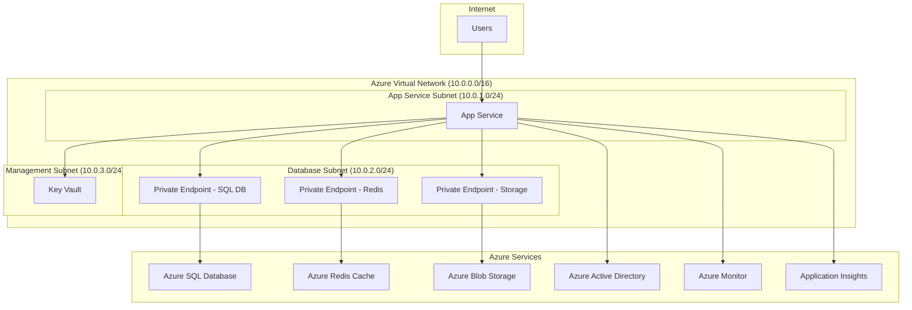

# インフラ設計書

## 概要
Azure環境でのFlaskアプリケーション運用に必要なインフラストラクチャを定義します。

## 利用Azureサービス一覧

| No | サービス名 | 用途 | SKU/プラン | 説明 |
|----|------------|------|------------|------|
| 1 | Azure App Service | Webアプリケーション実行 | Premium V3 P1V3 | Flaskアプリケーションのホスティング |
| 2 | Azure SQL Database | メインデータベース | Standard S2 | 作業実績データの格納 |
| 3 | Azure Blob Storage | ファイルストレージ | Standard GRS | CSVファイルとログファイルの保存 |
| 4 | Azure Redis Cache | キャッシュ・セッション | Basic C1 | セッション管理とデータキャッシュ |
| 5 | Azure Key Vault | シークレット管理 | Standard | 接続文字列とAPIキーの管理 |
| 6 | Azure Monitor | 監視・メトリクス | Standard | システム監視とアラート |
| 7 | Application Insights | アプリケーション監視 | Standard | パフォーマンス監視とログ分析 |
| 8 | Azure Active Directory | 認証・認可 | Free | ユーザー認証とアクセス制御 |
| 9 | Azure Virtual Network | ネットワーク | Standard | セキュアなネットワーク構成 |
| 10 | Azure Private Endpoint | プライベート接続 | Standard | データベースへの安全な接続 |

## ネットワーク構成

## リソース構成

### リソースグループ
- **名前**: `Devin-test`
- **リージョン**: Japan West
- **タグ**: 
  - Environment: Production
  - Project: CSV-SQLServer-Batch
  - Owner: yasutaka.yamakawa.sa@mhi.com

### App Service
- **名前**: `csv-batch-app-{random}`
- **プラン**: Premium V3 P1V3
- **OS**: Linux
- **ランタイム**: Python 3.11
- **設定**:
  - Always On: 有効
  - Auto Scale: 有効 (1-3インスタンス)
  - Health Check: /health
  - HTTPS Only: 有効

### Azure SQL Database
- **サーバー名**: `csv-batch-sqlserver-{random}`
- **データベース名**: `WorkRecordsDB`
- **SKU**: Standard S2 (50 DTU)
- **ストレージ**: 250GB
- **設定**:
  - Firewall: VNet統合のみ
  - Backup: 7日間保持
  - Geo-replication: 無効

### Azure Blob Storage
- **アカウント名**: `csvbatchstorage{random}`
- **種類**: StorageV2
- **レプリケーション**: GRS
- **コンテナ**:
  - `csv-input`: CSVファイル格納
  - `logs`: ログファイル格納
  - `backup`: バックアップファイル格納

### Azure Redis Cache
- **名前**: `csv-batch-redis-{random}`
- **SKU**: Basic C1 (1GB)
- **設定**:
  - SSL: 有効
  - Non-SSL port: 無効
  - Data persistence: 無効

## セキュリティ設定

### ネットワークセキュリティ
- **VNet統合**: App ServiceをVNetに統合
- **Private Endpoint**: データベースとストレージへの接続
- **NSG**: 必要最小限のポート開放
- **Firewall**: SQL DatabaseとRedisはVNetからのみアクセス

### 認証・認可
- **Azure AD**: シングルサインオン
- **Managed Identity**: App ServiceからAzureリソースへのアクセス
- **RBAC**: 最小権限の原則
- **Key Vault**: 機密情報の管理

### データ保護
- **暗号化**: 保存時・転送時の暗号化
- **TLS**: 1.3以上
- **証明書**: App Service Managed Certificate

## 監視・アラート設定

### メトリクス監視
- **CPU使用率**: 80%超過でアラート
- **メモリ使用率**: 85%超過でアラート
- **応答時間**: 5秒超過でアラート
- **エラー率**: 5%超過でアラート
- **データベース DTU**: 80%超過でアラート

### ログ監視
- **アプリケーションログ**: Application Insights
- **システムログ**: Azure Monitor
- **セキュリティログ**: Azure Security Center
- **監査ログ**: Azure Activity Log

### アラート通知
- **メール通知**: 管理者グループ
- **Teams通知**: 開発チーム
- **SMS通知**: 緊急時のみ

## バックアップ・災害復旧

### データベースバックアップ
- **自動バックアップ**: 日次
- **保持期間**: 7日間
- **復旧時間目標**: 1時間以内

### ファイルバックアップ
- **Blob Storage**: GRS レプリケーション
- **バックアップ頻度**: リアルタイム
- **復旧時間目標**: 30分以内

### アプリケーション復旧
- **デプロイスロット**: Blue-Green デプロイ
- **ロールバック**: 前バージョンへの即座復旧
- **復旧時間目標**: 15分以内

## コスト最適化

### 推定月額コスト (USD)
- App Service Premium V3 P1V3: $146
- Azure SQL Database Standard S2: $75
- Azure Blob Storage (100GB): $5
- Azure Redis Cache Basic C1: $20
- その他サービス: $30
- **合計**: 約 $276/月

### コスト削減策
- **Auto Scale**: 負荷に応じたスケーリング
- **Reserved Instance**: 1年予約で20%削減
- **Dev/Test環境**: 低スペック構成
- **ログ保持期間**: 必要最小限に設定

## 運用・保守

### デプロイ
- **CI/CD**: GitHub Actions
- **デプロイ方式**: Blue-Green デプロイ
- **環境**: Dev → Staging → Production

### メンテナンス
- **定期メンテナンス**: 月1回 (第3日曜日深夜)
- **セキュリティパッチ**: 月次適用
- **バックアップテスト**: 四半期ごと

### 監視・運用
- **24/7監視**: Azure Monitor
- **ログ分析**: Application Insights
- **パフォーマンス監視**: 継続的
- **容量計画**: 月次レビュー
