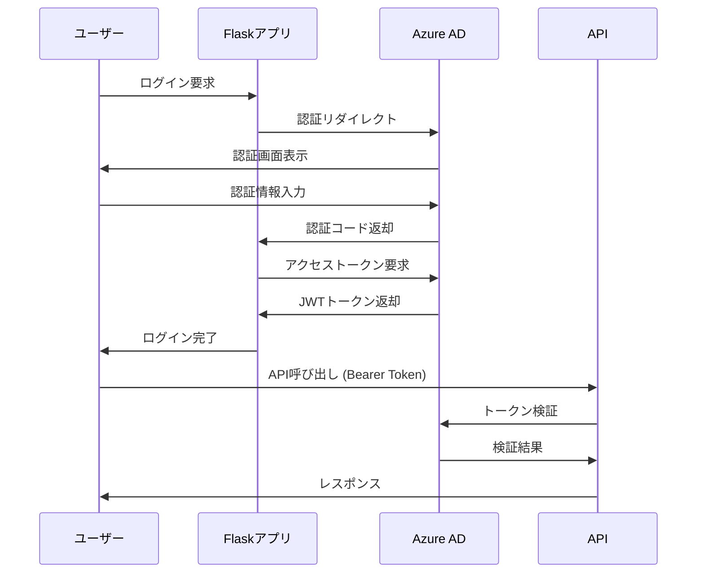

# セキュリティ設計書

## 概要
CSVからSQL Serverへのデータ変換バッチシステムのセキュリティ要件と実装方針を定義します。

## 認証・認可設計

### 認証方式

#### Azure Active Directory統合
- **認証プロバイダー**: Azure Active Directory (Azure AD)
- **認証フロー**: OAuth 2.0 / OpenID Connect
- **トークン形式**: JWT (JSON Web Token)
- **多要素認証**: 必須

#### 認証フロー


### 認可設計

#### ロールベースアクセス制御（RBAC）
| ロール | 権限 | 説明 |
|--------|------|------|
| admin | 全権限 | システム管理者 |
| operator | バッチ実行、監視 | 運用担当者 |
| viewer | 閲覧のみ | 閲覧専用ユーザー |

#### 権限マトリックス
| 機能 | admin | operator | viewer |
|------|-------|----------|--------|
| バッチ実行 | ○ | ○ | × |
| バッチ停止 | ○ | ○ | × |
| 処理履歴閲覧 | ○ | ○ | ○ |
| 設定変更 | ○ | × | × |
| ユーザー管理 | ○ | × | × |
| ログ閲覧 | ○ | ○ | ○ |

### 実装例

#### Flask-Login + Azure AD
```python
from flask import Flask, session, request, redirect, url_for
from flask_login import LoginManager, UserMixin, login_user, logout_user, login_required
import msal
import jwt

app = Flask(__name__)
login_manager = LoginManager()
login_manager.init_app(app)

class User(UserMixin):
    def __init__(self, user_id, name, email, roles):
        self.id = user_id
        self.name = name
        self.email = email
        self.roles = roles
    
    def has_role(self, role):
        return role in self.roles

@login_manager.user_loader
def load_user(user_id):
    return get_user_from_azure_ad(user_id)

def require_role(role):
    def decorator(f):
        @wraps(f)
        def decorated_function(*args, **kwargs):
            if not current_user.has_role(role):
                abort(403)
            return f(*args, **kwargs)
        return decorated_function
    return decorator

@app.route('/admin')
@login_required
@require_role('admin')
def admin_panel():
    return render_template('admin.html')
```

## データ保護

### 暗号化

#### 保存時暗号化
- **データベース**: Azure SQL Database Transparent Data Encryption (TDE)
- **ファイルストレージ**: Azure Blob Storage Server-Side Encryption (SSE)
- **アプリケーション設定**: Azure Key Vault

#### 転送時暗号化
- **HTTPS**: TLS 1.3以上
- **データベース接続**: SSL/TLS暗号化
- **内部通信**: mTLS (相互TLS)

### 個人情報保護

#### データマスキング
```python
import re

def mask_personal_info(data):
    if 'employee_name' in data:
        name = data['employee_name']
        if len(name) > 1:
            data['employee_name'] = name[0] + '*' * (len(name) - 1)
    
    if 'email' in data:
        email = data['email']
        local, domain = email.split('@')
        masked_local = local[0] + '*' * (len(local) - 1)
        data['email'] = f"{masked_local}@{domain}"
    
    return data

def log_with_masking(message, **kwargs):
    masked_kwargs = mask_personal_info(kwargs.copy())
    logger.info(message, **masked_kwargs)
```

## ネットワークセキュリティ

### ファイアウォール設定

#### Azure Network Security Group (NSG)
```json
{
  "securityRules": [
    {
      "name": "AllowHTTPS",
      "properties": {
        "protocol": "Tcp",
        "sourcePortRange": "*",
        "destinationPortRange": "443",
        "sourceAddressPrefix": "*",
        "destinationAddressPrefix": "*",
        "access": "Allow",
        "priority": 100,
        "direction": "Inbound"
      }
    },
    {
      "name": "DenyAll",
      "properties": {
        "protocol": "*",
        "sourcePortRange": "*",
        "destinationPortRange": "*",
        "sourceAddressPrefix": "*",
        "destinationAddressPrefix": "*",
        "access": "Deny",
        "priority": 4096,
        "direction": "Inbound"
      }
    }
  ]
}
```

## 入力検証・サニタイゼーション

### CSVファイル検証

#### ファイル形式検証
```python
import magic
import csv
from marshmallow import Schema, fields, ValidationError

class CSVFileValidator:
    MAX_FILE_SIZE = 100 * 1024 * 1024  # 100MB
    ALLOWED_MIME_TYPES = ['text/csv', 'application/csv']
    
    @classmethod
    def validate_file(cls, file_path):
        file_size = os.path.getsize(file_path)
        if file_size > cls.MAX_FILE_SIZE:
            raise ValidationError(f"ファイルサイズが上限を超過: {file_size} bytes")
        
        mime_type = magic.from_file(file_path, mime=True)
        if mime_type not in cls.ALLOWED_MIME_TYPES:
            raise ValidationError(f"不正なファイル形式: {mime_type}")
        
        try:
            with open(file_path, 'r', encoding='utf-8') as f:
                csv_reader = csv.reader(f)
                header = next(csv_reader)
                if len(header) != 11:
                    raise ValidationError(f"列数が不正: {len(header)}")
        except Exception as e:
            raise ValidationError(f"CSV形式エラー: {str(e)}")

class WorkRecordSchema(Schema):
    work_date = fields.Date(required=True)
    employee_id = fields.Str(required=True, validate=lambda x: len(x) <= 10)
    employee_name = fields.Str(required=True, validate=lambda x: len(x) <= 50)
    project_id = fields.Str(required=True, validate=lambda x: len(x) <= 20)
    project_name = fields.Str(required=True, validate=lambda x: len(x) <= 100)
    work_content = fields.Str(required=True, validate=lambda x: len(x) <= 200)
    work_hours = fields.Decimal(required=True, validate=lambda x: 0 <= x <= 999.99)
    hourly_rate = fields.Decimal(required=True, validate=lambda x: x >= 0)
    total_cost = fields.Decimal(required=True, validate=lambda x: x >= 0)
    order_amount = fields.Decimal(allow_none=True, validate=lambda x: x is None or x >= 0)
    remarks = fields.Str(allow_none=True, validate=lambda x: x is None or len(x) <= 500)
```

### SQLインジェクション対策

#### SQLAlchemy ORM使用
```python
from sqlalchemy.orm import sessionmaker
from sqlalchemy import text

def get_work_records_by_date(work_date):
    return session.query(WorkRecord)\
        .filter(WorkRecord.work_date == work_date)\
        .all()

def get_summary_by_period(start_date, end_date):
    query = text("""
        SELECT 
            COUNT(*) as total_records,
            SUM(total_cost) as total_cost
        FROM work_records 
        WHERE work_date BETWEEN :start_date AND :end_date
    """)
    
    result = session.execute(query, {
        'start_date': start_date,
        'end_date': end_date
    })
    return result.fetchone()
```

## セッション管理

### セッション設定
```python
from flask_session import Session
import redis

app.config['SESSION_TYPE'] = 'redis'
app.config['SESSION_REDIS'] = redis.from_url('redis://localhost:6379')
app.config['SESSION_PERMANENT'] = False
app.config['SESSION_USE_SIGNER'] = True
app.config['SESSION_KEY_PREFIX'] = 'csv_batch:'
app.config['SESSION_COOKIE_SECURE'] = True
app.config['SESSION_COOKIE_HTTPONLY'] = True
app.config['SESSION_COOKIE_SAMESITE'] = 'Lax'

Session(app)
```

## 監査ログ

### セキュリティイベント記録
```python
def log_security_event(event_type, user_id, details):
    security_logger.warning(
        "セキュリティイベント",
        event_type=event_type,
        user_id=user_id,
        remote_addr=request.remote_addr,
        user_agent=request.headers.get('User-Agent'),
        details=details,
        timestamp=datetime.utcnow().isoformat()
    )

@app.before_request
def log_request():
    if request.endpoint in ['auth.login', 'auth.logout']:
        log_security_event(
            event_type=f"auth_{request.endpoint.split('.')[-1]}",
            user_id=getattr(current_user, 'id', 'anonymous'),
            details={'endpoint': request.endpoint}
        )
```
