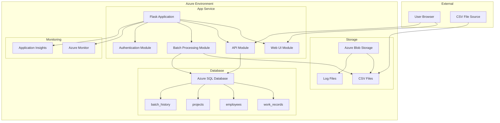

# システム全体設計書

## プロジェクト概要
人工作業実績データをCSVファイルからSQL Serverデータベースに変換・格納するバッチシステム

## 技術スタック

### 開発言語・フレームワーク
- **言語**: Python 3.11+
- **Webフレームワーク**: Flask 3.0+
- **テンプレートエンジン**: Jinja2
- **CSS フレームワーク**: TailwindCSS 3.4+
- **JavaScript**: Vanilla JavaScript (ES2022)
- **アーキテクチャ**: モノリシック構成（フロントエンド・バックエンド統合）

### データベース
- **メインDB**: SQL Server 2019+ (Azure SQL Database)
- **ORM**: SQLAlchemy 2.0+
- **マイグレーション**: Alembic

### テストライブラリ
- **単体テスト**: pytest 7.4+
- **カバレッジ**: pytest-cov
- **E2Eテスト**: Playwright for Python
- **負荷テスト**: Locust

### その他ライブラリ
- **CSVファイル処理**: pandas 2.0+
- **バリデーション**: marshmallow 3.20+
- **ログ**: structlog
- **設定管理**: python-dotenv
- **スケジューリング**: APScheduler
- **認証**: Flask-Login + Azure AD

## システム構成図



## アプリケーション構成

### ディレクトリ構造
```
src/
├── app.py                 # Flask アプリケーションエントリーポイント
├── config.py              # 設定管理
├── requirements.txt       # 依存関係
├── models/               # データモデル
│   ├── __init__.py
│   ├── work_record.py
│   ├── employee.py
│   ├── project.py
│   └── batch_history.py
├── views/                # ビュー（コントローラー）
│   ├── __init__.py
│   ├── dashboard.py
│   ├── batch.py
│   ├── api.py
│   └── auth.py
├── services/             # ビジネスロジック
│   ├── __init__.py
│   ├── csv_processor.py
│   ├── data_validator.py
│   ├── batch_service.py
│   └── notification_service.py
├── utils/                # ユーティリティ
│   ├── __init__.py
│   ├── logger.py
│   ├── database.py
│   └── azure_client.py
├── templates/            # HTMLテンプレート
│   ├── base.html
│   ├── dashboard.html
│   ├── batch_status.html
│   ├── history.html
│   └── login.html
├── static/               # 静的ファイル
│   ├── css/
│   │   └── style.css
│   ├── js/
│   │   └── main.js
│   └── images/
└── migrations/           # データベースマイグレーション
    └── versions/
```

## モジュール設計

### 1. Web UI Module (views/dashboard.py)
- **責務**: ユーザーインターフェースの提供
- **機能**:
  - ダッシュボード表示
  - バッチ処理状況監視
  - 処理履歴表示
  - 手動バッチ実行

### 2. API Module (views/api.py)
- **責務**: REST API エンドポイントの提供
- **機能**:
  - バッチ処理API
  - 監視データ取得API
  - 設定管理API

### 3. Batch Processing Module (services/batch_service.py)
- **責務**: CSVファイルの処理とデータベース更新
- **機能**:
  - CSVファイル読み込み
  - データバリデーション
  - SQL Server挿入
  - エラーハンドリング

### 4. Authentication Module (views/auth.py)
- **責務**: ユーザー認証・認可
- **機能**:
  - Azure AD連携
  - セッション管理
  - ロールベースアクセス制御

## データフロー

### バッチ処理フロー
1. **ファイル検出**: Azure Blob Storageから新しいCSVファイルを検出
2. **ファイル読み込み**: pandasでCSVファイルを読み込み
3. **データバリデーション**: marshmallowでデータ検証
4. **データ変換**: 必要に応じてデータ変換処理
5. **データベース更新**: SQLAlchemyでSQL Serverに挿入/更新
6. **結果記録**: 処理結果をbatch_historyテーブルに記録
7. **通知**: 処理完了/エラー通知の送信

### Web UI フロー
1. **認証**: Azure ADでユーザー認証
2. **ダッシュボード表示**: 処理状況とサマリー情報を表示
3. **操作実行**: 手動バッチ実行や設定変更
4. **リアルタイム更新**: WebSocketまたはポーリングで状況更新

## 非機能要件対応

### 性能
- **接続プール**: SQLAlchemy connection pooling
- **非同期処理**: Celery (Redis) でバッチ処理の非同期実行
- **キャッシュ**: Flask-Caching (Redis) でデータキャッシュ

### セキュリティ
- **認証**: Azure AD + Flask-Login
- **CSRF保護**: Flask-WTF
- **SQL インジェクション対策**: SQLAlchemy ORM使用
- **XSS対策**: Jinja2 自動エスケープ

### 監視・ログ
- **構造化ログ**: structlog使用
- **メトリクス**: Azure Application Insights
- **ヘルスチェック**: /health エンドポイント

## 環境設定

### 開発環境
- Python 3.11+
- SQL Server 2019+ (Docker)
- Redis (Docker)
- Azure Storage Emulator

### 本番環境
- Azure App Service (Python 3.11)
- Azure SQL Database
- Azure Redis Cache
- Azure Blob Storage
