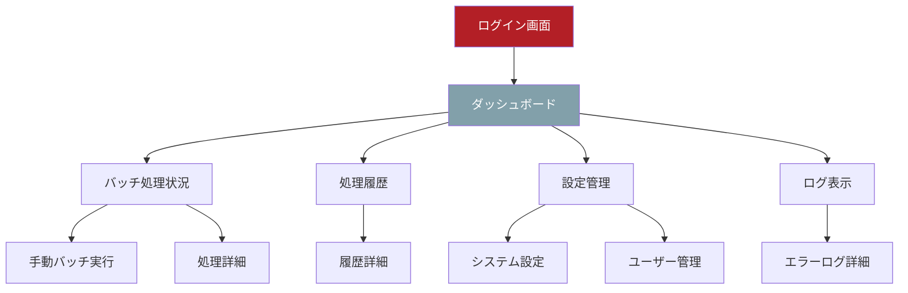

# UI/UX設計書

## 概要
人工作業実績データ変換バッチシステムの管理画面のUI/UX設計を定義します。

## 技術仕様

### 技術仕様
- **フレームワーク**: Flask 3.0+ (モノリシック構成)
- **テンプレートエンジン**: Jinja2
- **CSS**: TailwindCSS 3.4+
- **JavaScript**: Vanilla JavaScript (ES2022)
- **データベース**: Azure SQL Database (SQL Server)
- **インフラ**: Azure (Japan West)
- **テスト**: pytest (バックエンド), Playwright (E2E)

## デザインシステム

### カラーパレット
- **メインカラー**: 
  - Primary: #82A0AA (青緑)
  - Secondary: #FFFFFF (白)
- **サブカラー**:
  - Accent: #B31F26 (赤)
  - Text: #000000 (黒)
- **システムカラー**:
  - Success: #22C55E (緑)
  - Warning: #F59E0B (オレンジ)
  - Error: #EF4444 (赤)
  - Info: #3B82F6 (青)

### タイポグラフィ
- **フォントファミリー**: 
  - 日本語: "Noto Sans JP", sans-serif
  - 英数字: "Inter", sans-serif
- **フォントサイズ**:
  - H1: 2rem (32px)
  - H2: 1.5rem (24px)
  - H3: 1.25rem (20px)
  - Body: 1rem (16px)
  - Small: 0.875rem (14px)

### スペーシング
- **基本単位**: 4px
- **マージン/パディング**: 4px, 8px, 16px, 24px, 32px, 48px

## 画面遷移図



## 画面設計

### 1. ログイン画面 (login.html)

#### レイアウト
```
┌─────────────────────────────────────┐
│              ヘッダー                │
├─────────────────────────────────────┤
│                                     │
│         ┌─────────────────┐         │
│         │   ログインフォーム   │         │
│         │                 │         │
│         │ [Azure AD Login] │         │
│         └─────────────────┘         │
│                                     │
├─────────────────────────────────────┤
│              フッター                │
└─────────────────────────────────────┘
```

#### 機能要件
- Azure AD シングルサインオン
- レスポンシブデザイン対応
- ダークモード切り替え

### 2. ダッシュボード画面 (dashboard.html)

#### レイアウト
```
┌─────────────────────────────────────┐
│    ヘッダー [ユーザー名] [ログアウト]    │
├─────────────────────────────────────┤
│ ナビ │        メインコンテンツ        │
│ ゲー │ ┌─────────┐ ┌─────────┐     │
│ ショ │ │ 処理状況  │ │ 統計情報  │     │
│ ン   │ └─────────┘ └─────────┘     │
│     │ ┌─────────┐ ┌─────────┐     │
│     │ │ 最新履歴  │ │ アラート  │     │
│     │ └─────────┘ └─────────┘     │
├─────────────────────────────────────┤
│              フッター                │
└─────────────────────────────────────┘
```

#### 機能要件
- リアルタイム処理状況表示
- 統計情報のグラフ表示
- 最新処理履歴一覧
- アラート・通知表示

### 3. バッチ処理状況画面 (batch_status.html)

#### レイアウト
```
┌─────────────────────────────────────┐
│              ヘッダー                │
├─────────────────────────────────────┤
│ ナビ │ ┌─────────────────────────┐   │
│ ゲー │ │     手動実行ボタン        │   │
│ ショ │ ├─────────────────────────┤   │
│ ン   │ │     現在の処理状況        │   │
│     │ │ ┌─────┐ ┌─────┐ ┌─────┐ │   │
│     │ │ │ファイル│ │進捗率│ │状態 │ │   │
│     │ │ └─────┘ └─────┘ └─────┘ │   │
│     │ ├─────────────────────────┤   │
│     │ │      処理ログ表示         │   │
│     │ └─────────────────────────┘   │
├─────────────────────────────────────┤
│              フッター                │
└─────────────────────────────────────┘
```

#### 機能要件
- 手動バッチ実行ボタン
- リアルタイム進捗表示
- 処理ログのリアルタイム更新
- エラー発生時の詳細表示

### 4. 処理履歴画面 (history.html)

#### レイアウト
```
┌─────────────────────────────────────┐
│              ヘッダー                │
├─────────────────────────────────────┤
│ ナビ │ ┌─────────────────────────┐   │
│ ゲー │ │      検索・フィルター      │   │
│ ショ │ ├─────────────────────────┤   │
│ ン   │ │       履歴テーブル        │   │
│     │ │ ┌────┬────┬────┬────┐ │   │
│     │ │ │日時 │ファイル│状態│詳細│ │   │
│     │ │ ├────┼────┼────┼────┤ │   │
│     │ │ │... │ ...  │... │... │ │   │
│     │ │ └────┴────┴────┴────┘ │   │
│     │ ├─────────────────────────┤   │
│     │ │        ページネーション    │   │
│     │ └─────────────────────────┘   │
├─────────────────────────────────────┤
│              フッター                │
└─────────────────────────────────────┘
```

#### 機能要件
- 日付範囲での検索
- 処理状況でのフィルタリング
- ページネーション
- 詳細表示モーダル

## コンポーネント設計

### 1. ヘッダーコンポーネント
```html
<header class="bg-primary text-white p-4">
  <div class="container mx-auto flex justify-between items-center">
    <h1 class="text-xl font-bold">作業実績バッチシステム</h1>
    <div class="flex items-center space-x-4">
      <button id="theme-toggle" class="p-2 rounded">🌙</button>
      <span>{{ user.name }}</span>
      <a href="/logout" class="btn btn-secondary">ログアウト</a>
    </div>
  </div>
</header>
```

### 2. ナビゲーションコンポーネント
```html
<nav class="bg-gray-100 dark:bg-gray-800 w-64 min-h-screen p-4">
  <ul class="space-y-2">
    <li><a href="/dashboard" class="nav-link">ダッシュボード</a></li>
    <li><a href="/batch" class="nav-link">バッチ処理</a></li>
    <li><a href="/history" class="nav-link">処理履歴</a></li>
    <li><a href="/settings" class="nav-link">設定</a></li>
    <li><a href="/logs" class="nav-link">ログ</a></li>
  </ul>
</nav>
```

### 3. ステータスカードコンポーネント
```html
<div class="bg-white dark:bg-gray-800 rounded-lg shadow p-6">
  <div class="flex items-center justify-between">
    <div>
      <h3 class="text-lg font-semibold">{{ title }}</h3>
      <p class="text-2xl font-bold text-primary">{{ value }}</p>
    </div>
    <div class="text-4xl">{{ icon }}</div>
  </div>
</div>
```

### 4. プログレスバーコンポーネント
```html
<div class="w-full bg-gray-200 rounded-full h-2.5 dark:bg-gray-700">
  <div class="bg-primary h-2.5 rounded-full transition-all duration-300" 
       style="width: {{ progress }}%"></div>
</div>
<div class="text-sm text-gray-600 mt-1">{{ progress }}% 完了</div>
```

## レスポンシブデザイン

### ブレークポイント
- **Mobile**: < 640px
- **Tablet**: 640px - 1024px
- **Desktop**: > 1024px

### モバイル対応
```css
/* Mobile First */
.container {
  @apply px-4;
}

/* Tablet */
@media (min-width: 640px) {
  .container {
    @apply px-6;
  }
}

/* Desktop */
@media (min-width: 1024px) {
  .container {
    @apply px-8;
  }
}
```

## ダークモード対応

### CSS変数定義
```css
:root {
  --bg-primary: #ffffff;
  --bg-secondary: #f8f9fa;
  --text-primary: #000000;
  --text-secondary: #6b7280;
}

[data-theme="dark"] {
  --bg-primary: #1f2937;
  --bg-secondary: #374151;
  --text-primary: #ffffff;
  --text-secondary: #d1d5db;
}
```

### JavaScript切り替え
```javascript
function toggleTheme() {
  const html = document.documentElement;
  const currentTheme = html.getAttribute('data-theme');
  const newTheme = currentTheme === 'dark' ? 'light' : 'dark';
  
  html.setAttribute('data-theme', newTheme);
  localStorage.setItem('theme', newTheme);
}
```

## アクセシビリティ

### WCAG 2.1 AA準拠
- **コントラスト比**: 4.5:1以上
- **キーボードナビゲーション**: 全機能対応
- **スクリーンリーダー**: ARIA属性適用
- **フォーカス表示**: 明確な視覚的フィードバック

### セマンティックHTML
```html
<main role="main">
  <section aria-labelledby="dashboard-title">
    <h2 id="dashboard-title">ダッシュボード</h2>
    <!-- コンテンツ -->
  </section>
</main>
```

## パフォーマンス最適化

### 画像最適化
- WebP形式の使用
- 適切なサイズでの配信
- Lazy loading実装

### CSS/JavaScript最適化
- ファイルの圧縮
- 不要なコードの削除
- Critical CSS のインライン化

### キャッシュ戦略
- 静的ファイルの長期キャッシュ
- Service Worker実装
- CDN活用
