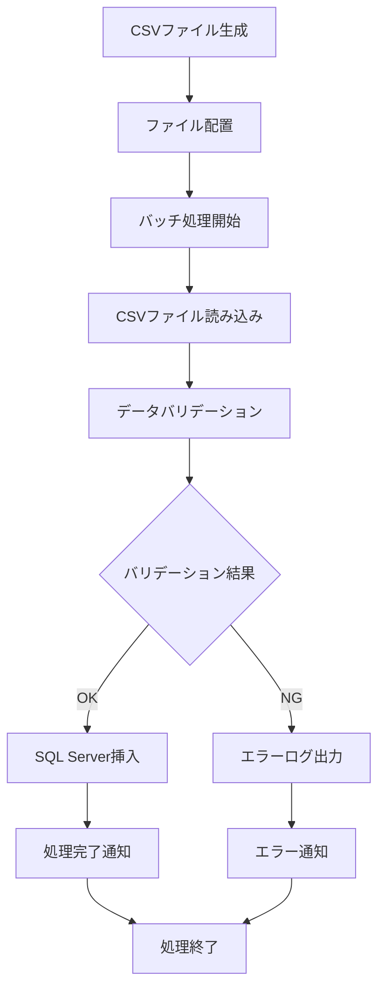

# 業務要件定義書

## プロジェクト概要
人工作業実績データをCSVファイルからSQL Serverデータベースに変換・格納するバッチシステムの開発

## 業務一覧

### 1. データ収集業務
- **業務名**: 人工作業実績データ収集
- **概要**: 月次の人工作業実績をCSVファイル形式で収集
- **頻度**: 月次
- **データ量**: 1ファイルあたり約1万件

### 2. データ変換業務
- **業務名**: CSVからSQL Serverへのデータ変換
- **概要**: 収集したCSVファイルをSQL Serverデータベースに格納
- **頻度**: 日次（1日1回）
- **処理時間**: 深夜バッチ処理

### 3. データ管理業務
- **業務名**: データベース管理・監視
- **概要**: SQL Serverデータベースの状態監視とメンテナンス
- **頻度**: 継続的

## 業務フロー図

## 対象データ

### CSVファイル仕様（提案）
| 項目名 | データ型 | 必須 | 説明 |
|--------|----------|------|------|
| 作業日 | DATE | ○ | 作業実施日 |
| 社員ID | VARCHAR(10) | ○ | 作業者の社員ID |
| 社員名 | VARCHAR(50) | ○ | 作業者名 |
| プロジェクトID | VARCHAR(20) | ○ | プロジェクト識別子 |
| プロジェクト名 | VARCHAR(100) | ○ | プロジェクト名称 |
| 作業内容 | VARCHAR(200) | ○ | 実施した作業の内容 |
| 工数 | DECIMAL(5,2) | ○ | 作業時間（時間単位） |
| 単価 | DECIMAL(10,0) | ○ | 時間単価（円） |
| 費用 | DECIMAL(12,0) | ○ | 総費用（円） |
| 発注金額 | DECIMAL(12,0) | △ | 外部発注金額（円） |
| 備考 | VARCHAR(500) | △ | 補足情報 |

### ファイル形式
- **エンコーディング**: UTF-8
- **区切り文字**: カンマ（,）
- **ヘッダー行**: あり
- **ファイル名形式**: `work_records_YYYYMMDD.csv`

## ステークホルダー
- **主要ユーザー**: 人事・経理部門
- **システム管理者**: IT部門
- **データ利用者**: プロジェクト管理者、経営陣

## 業務上の制約
- データの機密性確保が必要
- 月次締め処理との整合性確保
- 既存システムとの連携考慮
- Azure環境での運用
