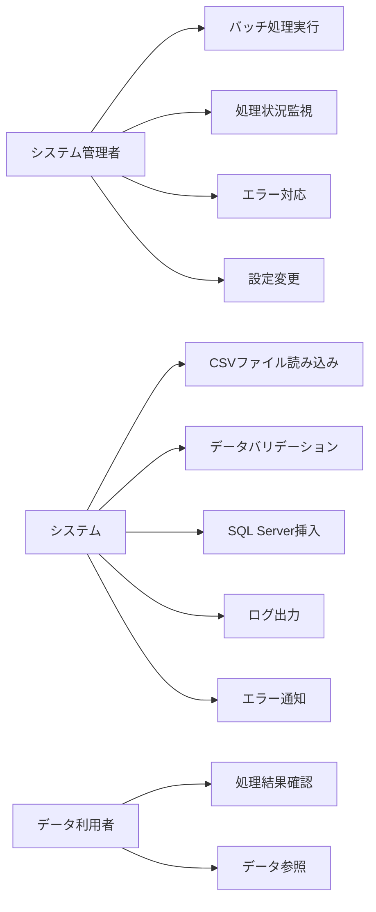

# 機能要件定義書

## 機能一覧

### 1. ファイル処理機能
#### 1.1 CSVファイル読み込み機能
- **機能ID**: F001
- **概要**: 指定されたディレクトリからCSVファイルを読み込む
- **入力**: CSVファイルパス
- **出力**: 読み込み結果（成功/失敗）
- **詳細**:
  - UTF-8エンコーディング対応
  - ヘッダー行の検証
  - ファイルサイズ制限チェック（最大100MB）

#### 1.2 データバリデーション機能
- **機能ID**: F002
- **概要**: 読み込んだデータの妥当性を検証
- **入力**: CSVデータ
- **出力**: バリデーション結果
- **詳細**:
  - 必須項目チェック
  - データ型チェック
  - 文字数制限チェック
  - 日付形式チェック
  - 数値範囲チェック

### 2. データベース操作機能
#### 2.1 SQL Server接続機能
- **機能ID**: F003
- **概要**: SQL Serverデータベースへの接続
- **入力**: 接続情報
- **出力**: 接続結果
- **詳細**:
  - 接続プール管理
  - 接続タイムアウト設定
  - 再接続機能

#### 2.2 データ挿入機能
- **機能ID**: F004
- **概要**: バリデーション済みデータをSQL Serverに挿入
- **入力**: バリデーション済みデータ
- **出力**: 挿入結果
- **詳細**:
  - バッチ挿入対応
  - 重複データ処理（UPSERT）
  - トランザクション管理

### 3. エラーハンドリング機能
#### 3.1 エラーログ出力機能
- **機能ID**: F005
- **概要**: エラー情報をログファイルに出力
- **入力**: エラー情報
- **出力**: ログファイル
- **詳細**:
  - エラーレベル分類
  - タイムスタンプ付与
  - ログローテーション

#### 3.2 エラー通知機能
- **機能ID**: F006
- **概要**: 重要なエラーを管理者に通知
- **入力**: エラー情報
- **出力**: 通知メール
- **詳細**:
  - メール通知
  - エラーレベル別通知設定

### 4. 監視・管理機能
#### 4.1 処理状況監視機能
- **機能ID**: F007
- **概要**: バッチ処理の進行状況を監視
- **入力**: 処理状況
- **出力**: 監視画面
- **詳細**:
  - リアルタイム進捗表示
  - 処理時間計測
  - 処理件数カウント

#### 4.2 処理履歴管理機能
- **機能ID**: F008
- **概要**: 過去の処理履歴を管理
- **入力**: 処理結果
- **出力**: 履歴データ
- **詳細**:
  - 処理日時記録
  - 処理件数記録
  - エラー件数記録

### 5. 設定管理機能
#### 5.1 設定ファイル管理機能
- **機能ID**: F009
- **概要**: システム設定を外部ファイルで管理
- **入力**: 設定ファイル
- **出力**: 設定値
- **詳細**:
  - JSON形式設定ファイル
  - 環境別設定対応
  - 設定値バリデーション

## ユースケース図

## 画面・インターフェース要件

### 1. 管理画面（フロントエンド）
- **技術**: Next.js 15 App Router + TypeScript
- **機能**:
  - バッチ処理実行
  - 処理状況監視
  - 処理履歴表示
  - エラーログ表示
  - 設定管理

### 2. API（バックエンド）
- **技術**: Rust または Go
- **機能**:
  - バッチ処理API
  - 監視API
  - 履歴取得API
  - 設定管理API

## データフロー
1. CSVファイル → ファイル読み込み → データバリデーション
2. バリデーション済みデータ → SQL Server挿入
3. 処理結果 → ログ出力 → 通知
4. 処理履歴 → データベース保存
